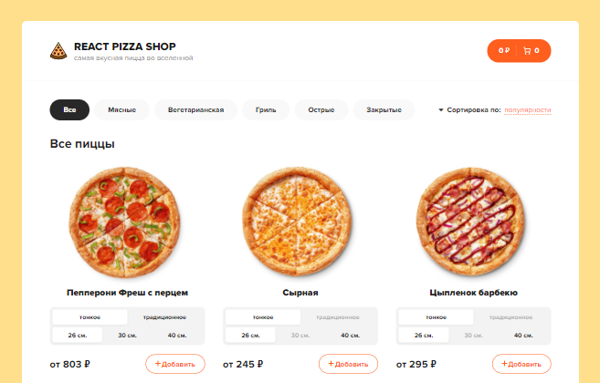

<h1 align="center">React Pizza Shop</h1>

<p align="center">
    
    
    
    
    
</p>

[Demo React Pizza Shop](https://reactpizza-app.herokuapp.com/)



## Description

<p>
Online store for ordering pizza - React Pizza Shop
</p>

## Stack

- HTML5 + SCSS
- ReactJS + hooks
- React Router
- Redux
- Redux thunk
- json-server
- Axios
- classnames

## Project setup

```
npm install
npm run server
```
